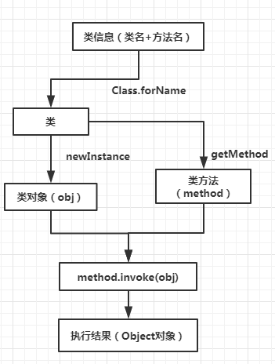
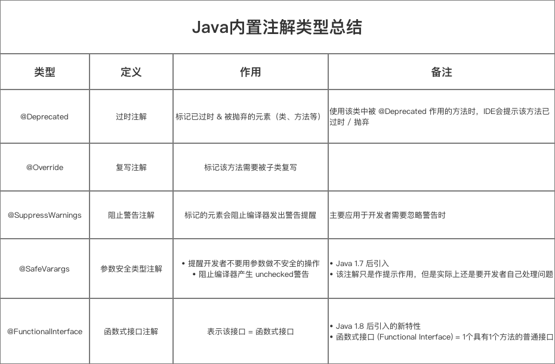

# Java 基础


## Java 反射


### 应用

- 利用动态代理实现面向切面编程
- 与注解相结合
- 解决泛型擦除

### 基本流程




实例


```java
public class Student {
    private  String name;
    private  int age;
    private  int sex;
    public Student(){
        this.name="2B";
        this.age=0;
        this.sex=1;
    }

    public Student(String name, int age, int sex) {
        this.name = name;
        this.age = age;
        this.sex = sex;
    }

    /**
     * 获取学生的名字
     * @return
     */
    public String getName(){
        System.out.println("getName被执行了");
        return this.name;
    }
}
```


```java
@Test
public void test00() throws Exception{
    String className = "reflection.Student"; //包名+类名
    String methodName = "getName";           //方法名


    Class<?> student = Class.forName(className);  //获取类
    Object obj = student.newInstance();           //根据类实例化出对象
    Field[] fields = student.getDeclaredFields();
    Method method = student.getMethod(methodName);//获取想要执行的方法
    Object methodReturn = method.invoke(obj);     //让某个对象执行这个方法
    System.out.println(methodReturn);             //输出该方法返回的值

}
```


**参考资料**

- [Java反射机制应用实践](https://mp.weixin.qq.com/s?__biz=MzUyODg4Nzk2MQ==&mid=2247491189&amp;idx=3&amp;sn=668c0739628e1b9192c32ad892b78c45&source=41#wechat_redirect)


## Java 注解

### 1、什么是注解？

官方解释：

> Java 注解用于为 Java 代码提供元数据。作为元数据，注解不直接影响你的代码执行，但也有一些类型的注解实际上可以用于这一目的。Java 注解是从 Java5 开始添加到 Java 的。

个人理解：

> 注解≈标签


### 2、注解的使用场景？

我们先不谈如何实现注解，我们从需求出发，先看看注解该如何使用。

- 生成文档。这是最常见的，也是java 最早提供的注解。常用的有@param @return 等
- 跟踪代码依赖性，实现替代配置文件功能。比如Dagger 2依赖注入，未来java开发，将大量注解配置，具有很大用处;
- 在编译时进行格式检查。如@override 放在方法前，如果你这个方法并不是覆盖了超类方法，则编译时就能检查出。


### 3、注解原理

　　注解本质是一个**继承了Annotation的特殊接口**，其具体实现类是Java运行时生成的**动态代理类**。而我们通过反射获取注解时，返回的是Java运行时生成的动态代理对象$Proxy1。通过代理对象调用自定义注解（接口）的方法，**会最终调用AnnotationInvocationHandler的invoke方法**。该方法会从memberValues这个Map中索引出对应的值。而memberValues的来源是Java常量池。


### 4、注解类型

- 元注解
- Java 内置注解
- 自定义注解


（1）元注解

- @Retention：描述注解生命周期，例如`@Retention(RetentionPolicy.RUNTIME)`
- @Documented：将注解中的元素包含到 `Javadoc`文档中
- @Target：限定了注解作用的目标范围，包括类、方法等等
- @Inherited：使得一个 **被@Inherited注解的注解** 作用的类的子类可以继承该类的注解 
- @Repeatable：使得作用的注解可以取多个值（Java1.8）


（2）Java 内置注解

- @Deprecated：标记已过时 & 被抛弃的元素（类、方法等）
- @Override：标记该方法需要被子类复写
- @SuppressWarnings：标记的元素会阻止编译器发出警告提醒 （主要应用于开发者需要忽略警告时）
- @SafeVarargs：提醒开发者不要用参数做不安全的操作 & 阻止编译器产生 `unchecked`警告（1.7引入）
- @FunctionalInterface：表示该接口 = 函数式接口（1.8引入，例如`Runnable `接口就是使用了该注解）




（3）自定义注解


**定义一个注解**

```java
// 通过 @interface 关键字进行定义
// 形式类似于接口，区别在于多了一个 @ 符号
public @interface MyAnnotation {
	// 注解的属性 = 成员变量
	// 注解只有成员变量，没有方法

    // 注解@MyAnnotation中有2个属性：id 和 msg  
    int id();
    String msg() default "Hi" ;

    // 说明：
    // 注解的属性以 “无形参的方法” 形式来声明
    // 方法名 = 属性名
    // 方法返回值 = 属性类型 = 8 种基本数据类型 + 类、接口、注解及对应数组类型
    // 用 default 关键值指定 属性的默认值，如上面的msg的默认值 = ”Hi“
}
```


Demo地址如下：

<https://github.com/Taoey/DAS/tree/master/JavaBase/src/main/java/annotation>


**参考资料**

- [秒懂，Java 注解 （Annotation）你可以这样学](https://blog.csdn.net/briblue/article/details/73824058)
- [Java自定义注解的使用场景和原理](https://blog.csdn.net/PORSCHE_GT3RS/article/details/80304701)
- [Java 注解（Annotation）：带你一步步探索神秘的注解（Annotation）](https://blog.csdn.net/carson_ho/article/details/80728428)


