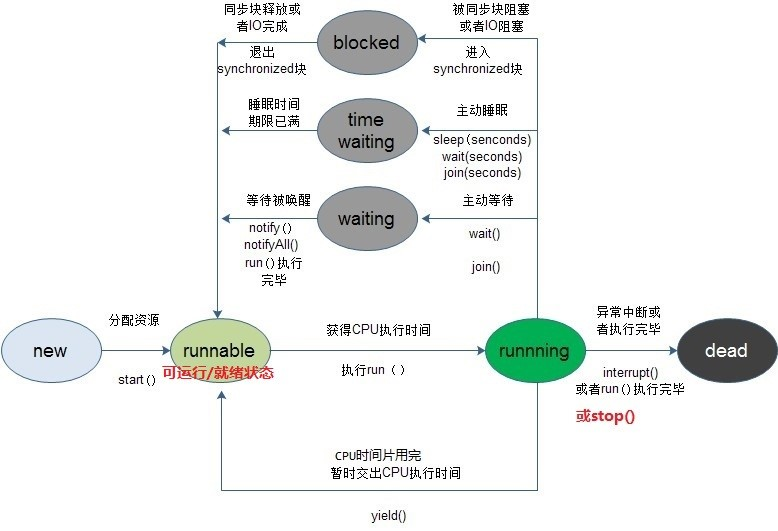

# Java 并发


## 一、Java线程的5种状态及状态转化

- **新建状态**（New）：当线程对象对创建后，即进入了新建状态，如：Thread t = new MyThread();

- **就绪状态**（Runnable）：当调用线程对象的start()方法（t.start();），线程即进入就绪状态。处于就绪状态的线程，只是说明此线程已经做好了准备，随时等待CPU调度执行，并不是说执行了t.start()此线程立即就会执行；

- **运行状态**（Running）：当CPU开始调度处于就绪状态的线程时，此时线程才得以真正执行，即进入到运行状态。注意：就绪状态是进入到运行状态的唯一入口，也就是说，线程要想进入运行状态执行，首先必须处于就绪状态中；

- **阻塞状态**（Blocked）：处于运行状态中的线程由于某种原因，暂时放弃对CPU的使用权，停止执行，此时进入阻塞状态，直到其进入到就绪状态，才 有机会再次被CPU调用以进入到运行状态。根据阻塞产生的原因不同，阻塞状态又可以分为三种：
  - 同步阻塞 -- 线程在获取synchronized同步锁失败(因为锁被其它线程所占用)，它会进入同步阻塞状态；
  - 等待阻塞：运行状态中的线程执行wait()方法，使本线程进入到等待阻塞状态；
  - 其他阻塞 -- 通过调用线程的sleep()或join()或发出了I/O请求时，线程会进入到阻塞状态。当sleep()状态超时、join()等待线程终止或者超时、或者I/O处理完毕时，线程重新转入就绪状态。

- **死亡状态**（Dead）：线程执行完了或者因异常退出了run()方法，该线程结束生命周期。


一个正常的生命周期：new-->Runnable-->Running-->Dead  共经历4个阶段

 

注意：

调用interrupt()会立即将线程的中断标记设为“true”，但是由于线程处于阻塞状态，所以该“中断标记”会立即被清除为“false”，同时，会产生一个InterruptedException的异常。




## 二、Java中实现线程的三种方法

### 1、实现方式

- 继承Thread类

- 实现Runnable接口（推荐）

- 实现Callable接口

**注意：**

实现 Runnable 和 Callable 接口的类只能当做一个可以在线程中运行的**任务**，不是真正意义上的线程，因此最后还需要通过 Thread 来调用。可以说任务是通过线程驱动从而执行的。

### 2、实现接口 VS 继承 Thread

实现接口会更好一些，因为：

- Java 不支持多重继承，因此继承了Thread 类就无法继承其它类，但是可以实现多个接口
- 类可能只要求可执行就行，继承整个 Thread 类开销过大

### 3、三种方式的区别

- 实现 Runnable 接口可以避免 Java单继承特性而带来的局限，增强程序的健壮性，代码能够被多个线程共享，代码与数据是独立的，适合多个相同程序代码的线程区处理同一资源的情况
- 继承 Thread 类和实现 Runnable方法启动线程都是使用 start() 方法，然后 JVM 虚拟机将此线程放到就绪队列中，如果有处理机可用，则执行 run() 方法
- 实现 Callable 接口要实现 call()方法，并且线程执行完毕后会有返回值。其他的两种都是重写 run() 方法，没有返回值

### 4、具体实现

#### 继承Thread类

```java
public class MyThread extends Thread {
    public void run() {
        // ...
    }
}
public static void main(String[] args) {
    MyThread mt = new MyThread();
    mt.start();
}
```

#### 实现 Runnable 接口

需要实现 run() 方法，通过 Thread 调用 start() 方法来启动线程。

```java
public class MyRunnable implements Runnable {
    public void run() {
        // ...
    }
}
public static void main(String[] args) {
    MyRunnable instance = new MyRunnable();
    Thread thread = new Thread(instance);
    thread.start();
}

```

#### 实现 Callable 接口


```java
public class MyCallable implements Callable<Integer> {
    public Integer call() {
        return 123;
    }
}
public static void main(String[] args) throws ExecutionException, InterruptedException {
    MyCallable mc = new MyCallable();
    FutureTask<Integer> ft = new FutureTask<>(mc);
    Thread thread = new Thread(ft);
    thread.start();
    System.out.println(ft.get());
}
```

