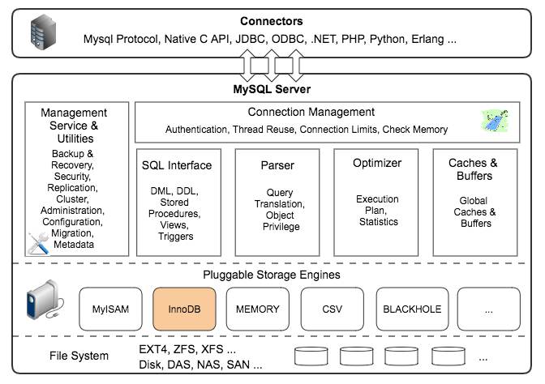
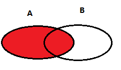
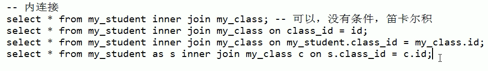

# MySQL

   * [MySQL](#mysql)
      * [一 、MySQL 基础](#一-mysql-基础)
         * [1、MySQL基础架构](#1mysql基础架构)
      * [二、索引](#二索引)
      * [三、存储引擎](#三存储引擎)
      * [四、事务](#四事务)
      * [五、查询性能优化](#五查询性能优化)
      * [六、复制](#六复制)

## 一 、MySQL 基础

### 1、MySQL基础架构



### 2、数据库范式

- 第一范式：主要为了防止表中有表的情况；
- 第二范式：要求表中的每一列数据都要和主键相关；
- 第三范式：要求表中的每一列数据都要和主键**直接**相关；
- BC范式：为了防止主键之间存在传递依赖；


### 3、数据更新：update

#### update语句常见场景,分为两大类

- 单表update

- 多表关联update


实验对象：两个学生表
- 一个stu学生表,一个stu1学生表.
- 上述表有三个字段 (学生id,学生性别,学生名字)
  

#### 单表update单字段

```sql
update stu t set t.NAME = 'mike' where t.ID = '1';
```

#### 单表update多字段

```sql
update stu t set t.NAME = 'mike', t.SEX = '1' where t.ID = '2';
```

多表关联update的时候,记得要加**exists()**条件,否则不满足条件的记录被update称NULL：
比如：stu表存在,但stu1表不存在的数据,对应的字段会被updat成NULL;

#### 多表关联update单字段

```sql
update stu t set t.NAME = (select t1.NAME from stu1 t1 where t1.ID = t.ID)
where exists(select 1 from stu1 t2 where t2.ID = t.ID);
```

#### 多表关联update多字段

```sql
update stu t set (t.NAME, t.SEX) = (select t1.NAME, t1.SEX from stu1 t1 where t1.ID = t.ID)
where exists(select 1 from stu1 t2 where t2.ID = t.ID)
```


**参考资料**

- [SQL Update的四种常见写法](https://blog.csdn.net/wuya814070935/article/details/72675410)

### 4、连接查询

连接查询如果只算语法的话有**5种**连接。假设有两个表A、B，A表数据数量为M，B表数据数量为N（如果不理解如下连接方式，可查看参考资料，里面有相关表示图，更加直观）



- **交叉连接**：cross join；左右两表做笛卡尔积操作，数据数量为两表数量之积：M*N
- **外连接**（主表中的数据全部保留，有左连接和右连接两种）
  - **左连接**：left join；两表关联，左表全部保留，右表关联不上用null表示。
  - **右连接**：right join；右表全部保留，左表关联不上的用null表示。

- **内连接**：inner join；两表关联，保留两表中交集的记录。

- **全连接**：full join（Oracle），union（MySQL）；两表关联，查询它们的所有记录。

其他：

- **左表独有**：select * from t1 left join t2 on t1.id = t2.id where t2.id is null;
- **右表独有**：select * from t1 right join t2 on t1.id = t2.id where t1.id is  null;


**补充说明**

**（1）内连接**

**原理**

- 利用第一张表取出一条记录，从另一张表中进行匹配
- 利用匹配条件进行匹配
  - 匹配到：保留，继续向下匹配
  - 匹配失败：继续向下，如果全部匹配失败，结束

**注意**

- 如果内连接没有匹配条件就是其实就是交叉连接，应该极力避免
- 表的设计通常容易产生同名字段，一般使用“表名.字段名”来保证



**（2）外连接**

**原理**

- 确定连接的主表
- 拿主表的一条数据去匹配另一张表的数据
  - 满足，保留；
  - 不满足，继续在从表中匹配
    - 如果主表记录在从表记录中一个都没有匹配到，也要保留该记录，从表对应的记录都设置为null


**其他相关注意**

- 如果inner join 没有匹配条件（就是没有on）就是其实就是交叉连接，应该极力避免，例如：`select * from a inner join b`


参考资料**

- [mysql的几种join](https://blog.csdn.net/u012410733/article/details/63684663)

- [MySQL JOIN原理](https://blog.csdn.net/justlpf/article/details/81093216)


## 二、索引


## 三、存储引擎


## 四、事务


## 五、查询性能优化


## 六、复制


