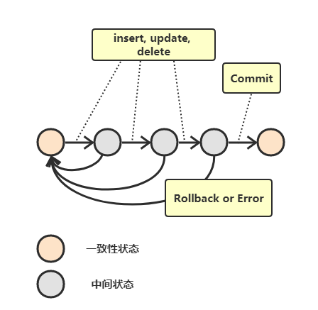
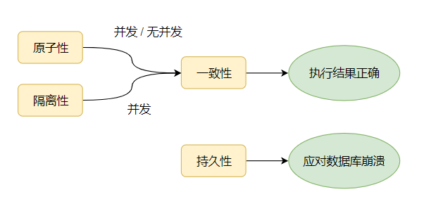
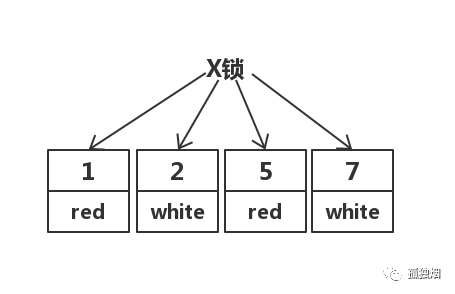
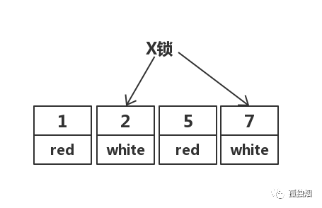
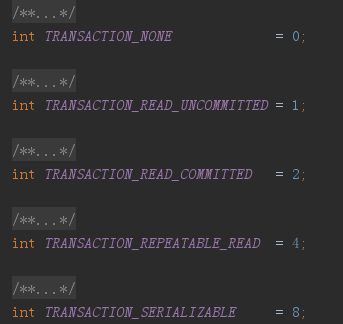
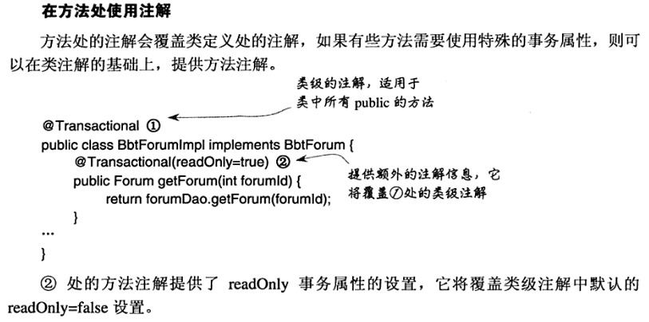
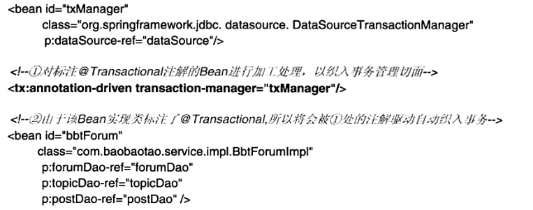
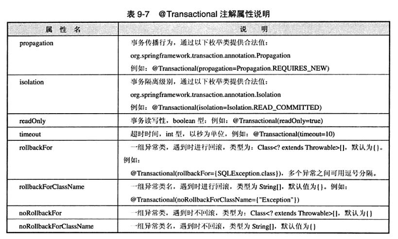

# MySQL

   * [MySQL](#mysql)
      * [一 、MySQL 基础](#一-mysql-基础)
         * [1、MySQL基础架构](#1mysql基础架构)
         * [2、数据库范式](#2数据库范式)
         * [3、数据更新：update](#3数据更新update)
            * [update语句常见场景,分为两大类](#update语句常见场景分为两大类)
            * [单表update单字段](#单表update单字段)
            * [单表update多字段](#单表update多字段)
            * [多表关联update单字段](#多表关联update单字段)
            * [多表关联update多字段](#多表关联update多字段)
         * [4、数据查询：连接查询](#4数据查询连接查询)
         * [5、重置自增](#5重置自增)
            * [（1）truncate方法(效率高，谨慎使用)](#1truncate方法效率高谨慎使用)
            * [（2）delete(数据量大则效率低)](#2delete数据量大则效率低)
      * [二、索引](#二索引)
      * [三、存储引擎](#三存储引擎)
      * [四、事务](#四事务)
         * [（1）什么是事务？](#1什么是事务)
         * [（2）事务四大特性(ACID)](#2事务四大特性acid)
            * [原子性（Atomicity）](#原子性atomicity)
            * [一致性（Consistency）](#一致性consistency)
            * [隔离性（Isolation）](#隔离性isolation)
            * [持久性（Durability）](#持久性durability)
         * [（3）MySQL事务操作](#3mysql事务操作)
         * [（4）JDBC事务操作](#4jdbc事务操作)
      * [五、数据并发问题](#五数据并发问题)
      * [六、数据库隔离级别及相关问题](#六数据库隔离级别及相关问题)
         * [1、什么是隔离级别？](#1什么是隔离级别)
         * [2、隔离级别分类](#2隔离级别分类)
         * [3、隔离级别详细解读](#3隔离级别详细解读)
         * [4、在项目中设置数据隔离级别](#4在项目中设置数据隔离级别)
      * [七、查询性能优化](#七查询性能优化)

## 一 、MySQL 基础

### 1、MySQL基础架构

<div align="center"> </div>

### 2、数据库范式

- 第一范式：主要为了防止表中有表的情况；
- 第二范式：要求表中的每一列数据都要和主键相关；
- 第三范式：要求表中的每一列数据都要和主键**直接**相关；
- BC范式：为了防止主键之间存在传递依赖；


### 3、数据更新：update

#### update语句常见场景,分为两大类

- 单表update

- 多表关联update


实验对象：两个学生表
- 一个stu学生表,一个stu1学生表.
- 上述表有三个字段 (学生id,学生性别,学生名字)
  

#### 单表update单字段

```sql
update stu t set t.NAME = 'mike' where t.ID = '1';
```

#### 单表update多字段

```sql
update stu t set t.NAME = 'mike', t.SEX = '1' where t.ID = '2';
```

多表关联update的时候,记得要加**exists()**条件,否则不满足条件的记录被update称NULL：
比如：stu表存在,但stu1表不存在的数据,对应的字段会被updat成NULL;

#### 多表关联update单字段

```sql
update stu t set t.NAME = (select t1.NAME from stu1 t1 where t1.ID = t.ID)
where exists(select 1 from stu1 t2 where t2.ID = t.ID);
```

#### 多表关联update多字段

```sql
update stu t set (t.NAME, t.SEX) = (select t1.NAME, t1.SEX from stu1 t1 where t1.ID = t.ID)
where exists(select 1 from stu1 t2 where t2.ID = t.ID)
```


**参考资料**

- [SQL Update的四种常见写法](https://blog.csdn.net/wuya814070935/article/details/72675410)

### 4、数据查询：连接查询

连接查询如果只算语法的话有**5种**连接。假设有两个表A、B，A表数据数量为M，B表数据数量为N（如果不理解如下连接方式，可查看参考资料，里面有相关表示图，更加直观）

<div align="center"> </div>

- **交叉连接**：cross join；左右两表做笛卡尔积操作，数据数量为两表数量之积：M*N
- **外连接**（主表中的数据全部保留，有左连接和右连接两种）
  - **左连接**：left join；两表关联，左表全部保留，右表关联不上用null表示。
  - **右连接**：right join；右表全部保留，左表关联不上的用null表示。

- **内连接**：inner join；两表关联，保留两表中交集的记录。

- **全连接**：full join（Oracle），union（MySQL）；两表关联，查询它们的所有记录。

其他：

- **左表独有**：select * from t1 left join t2 on t1.id = t2.id where t2.id is null;
- **右表独有**：select * from t1 right join t2 on t1.id = t2.id where t1.id is  null;


**补充说明**

**（1）内连接**

**原理**

- 利用第一张表取出一条记录，从另一张表中进行匹配
- 利用匹配条件进行匹配
  - 匹配到：保留，继续向下匹配
  - 匹配失败：继续向下，如果全部匹配失败，结束

**注意**

- 如果内连接没有匹配条件就是其实就是交叉连接，应该极力避免
- 表的设计通常容易产生同名字段，一般使用“表名.字段名”来保证


**（2）外连接**

**原理**

- 确定连接的主表
- 拿主表的一条数据去匹配另一张表的数据
  - 满足，保留；
  - 不满足，继续在从表中匹配
    - 如果主表记录在从表记录中一个都没有匹配到，也要保留该记录，从表对应的记录都设置为null

**其他相关注意**

- 如果inner join 没有匹配条件（就是没有on）就是其实就是交叉连接，应该极力避免，例如：`select * from a inner join b`


**参考资料**

- [mysql的几种join](https://blog.csdn.net/u012410733/article/details/63684663)

- [MySQL JOIN原理](https://blog.csdn.net/justlpf/article/details/81093216)


### 5、重置自增

- truncate
- delete

#### （1）truncate方法(效率高，谨慎使用)

清空表数据并重置id：

```sql
truncate table table_name;
```

注意：truncate 一次性地从表中删除所有的数据并不把单独的删除操作记录记入日志保存，删除行是不能恢复的。并且在删除的过程中不会激活与表有关的删除触发器。执行速度快。

是DLL语言，无法回滚；当表被TRUNCATE 后，这个表和索引所占用的空间会恢复到初始大小。 

#### （2）delete(数据量大则效率低)

delete from table_name;

alter table table_name auto_increment= 1;


## 二、索引


## 三、存储引擎


## 四、事务

### （1）什么是事务？

事务指的是满足 ACID 特性的一组操作，可以通过 Commit 提交一个事务，也可以使用 Rollback 进行回滚。MySQL 默认 自动提交模式`AUTOCOMMIT`，也就是说，如果不显式使用 ` start transaction` 语句来开始一个事务，那么每个查询都会被当做一个事务自动提交。。



### （2）事务四大特性(ACID)



#### 原子性（Atomicity）

原子性是指事务是一个不可分割的工作单位，事务中的操作要么全部成功，要么全部失败。比如转账过去的`加操作`和转账时候的`减操作`必须一次发生

#### 一致性（Consistency）

**最重要**的特征，其他特征都是为了一致性。事务必须使数据库**从一个一致性**状态变换**到另外一个一致性**状态。

以转账为例子，A向B转账，假设转账之前这两个用户的钱加起来总共是2000，那么A向B转账之后，不管这两个账户怎么转，A用户的钱和B用户的钱加起来的总额还是2000，这个就是事务的一致性。

#### 隔离性（Isolation）

隔离性是当多个用户并发访问数据库时，比如操作同一张表时，数据库为每一个用户开启的事务，不能被其他事
务的操作所干扰，**多个并发事务之间要相互隔离**。
即要达到这么一种效果：对于任意两个并发的事务 T1 和 T2，在事务 T1 看来，T2 要么在 T1 开始之前就已经结
束，要么在 T1 结束之后才开始，这样**每个事务都感觉不到有其他事务在并发地执行**。

#### 持久性（Durability）

一旦事务提交，则其所做的修改将会永远保存到数据库中。即使系统发生崩溃，事务执行的结果也不能丢失。

可以通过数据库备份和恢复来实现，在系统发生奔溃时，使用备份的数据库进行数据恢复。


**相关理解**

事务的 ACID 特性概念简单，但不是很好理解，主要是因为这几个特性不是一种平级关系。

- 只有满足一致性，事务的执行结果才是正确的
- 在无并发的情况下，事务串行执行，隔离性一定能够满足。此时要只要能满足原子性，就一定能满足一致性
- 在并发的情况下，多个事务并发执行，事务不仅要满足原子性，还需要满足隔离性，才能满足一致性
- 事务满足持久化是为了能应对数据库奔溃的情况。

#### 

### （3）MySQL事务操作

- 开始事务：`start transaction`
- 回滚事务：`rollback`
- 提交事务：`commit`


### （4）JDBC事务操作

```java
try{
	con.setAutoCommit(false); //设置事务为非自动提交
	// do something
    con.commit();             //正常操作完成，提交事务
}catch(Exception e){
    con.rollback();          // 发生异常，回滚事务
}
```


## 五、数据并发问题

- 脏读
- 不可重复读
- 幻读
- 第一类丢失更新
- 第二类丢失更新


**脏读和幻读有什么不同？**

- 脏读读取到的是"更改数据（更改或删除）"，采用加行级锁方式应对（锁定行数据）
- 幻读读取到的是"插入数据"，采用加表级锁的方式应对（锁定表数据）


## 六、数据库隔离级别及相关问题

### 1、什么是隔离级别？

SQL标准制定的规则，用来限定事务内外的哪些改变是可见的，哪些是不可见的。低级别的隔离级一般支持更高的并发处理，并拥有更低的系统开销。

### 2、隔离级别分类

先来简单做个大体了解：

- RU——Read Uncommitted（读取未提交内容）—>脏读问题
- RC——Read Committed（读取提交内容）
- RR——Repeatable Read（可重读）—>幻读问题
- S——Serializable（可串行化）


四个级别逐渐增强，每个级别解决一个问题，事务级别越高，性能越差，大多数环境使用Read committed 就可以

| 隔离级别     | 脏读 | 不可重复读 | 幻读 |
| ------------ | ---- | ---------- | ---- |
| RU——未提交读 | √    | √          | √    |
| RC——提交读   |      | √          | √    |
| RR——可重复读 |      |            | √    |
| S——可串行化  |      |            |      |


### 3、隔离级别详细解读

**RU——Read Uncommitted（读取未提交内容）**

关键词：无隔离，很少应用，脏读

在该隔离级别，所有事务都可以看到其他未提交事务的执行结果。本隔离级别很少用于实际应用，因为它的性能也不比其他级别好多少。读取未提交的数据，也被称之为脏读（Dirty Read）。 

**RC——Read Committed（读取提交内容）**

关键词：大多数数据库，Oracle默认，项目中使用，性能还行

这是大多数数据库系统的默认隔离级别（但不是MySQL默认的）。它满足了简单的隔离 定义：一个事务只能看见已经提交事务所做的改变。这种隔离级别 也支持所谓的不可重复读（Nonrepeatable Read），因为同一事务的其他实例在该实例处理其间可能会有新的commit，所以同一select可能返回不同结果。 因此**实际项目开发多采用该数据隔离级别**。

**RR——Repeatable Read（可重读）** 

关键词：MySQL默认

MySQL默认隔离级别，它确保同一事务的多个实例在并发读取数据时，会看到同样的数据行。不过理论上，这会导致另一个棘手的问题：幻读 （Phantom Read）。简单的说，幻读指当用户读取某一范围的数据行时，另一个事务又在该范围内插入了新行，当用户再读取该范围的数据行时，会发现有新的“幻影” 行。InnoDB和Falcon存储引擎通过**多版本并发控制**（MVCC，Multiversion Concurrency Control）机制解决了该问题。 

**S——Serializable（可串行化）**

关键词：安全，性能差，共享锁

最高的隔离级别，不会引起任何并发问题，因为他对同一数据的访问是串行的，非并发访问的性能最差，容易引起死锁。


**数据隔离级别解读**

相关引言

> 面试官：“讲讲mysql有几个事务隔离级别？”
>
> 你：“读未提交，读已提交，可重复读，串行化四个！默认是可重复读”
>
> 面试官：“为什么mysql选可重复读作为默认的隔离级别？”
>
> (你面露苦色，不知如何回答！)
>
> 面试官:"你们项目中选了哪个隔离级别？为什么？"
>
> 你：“当然是默认的可重复读，至于原因。。呃。。。”(然后你就可以回去等通知了！)


**问题一：为什么mysql选可重复读作为默认的隔离级别？**

//TODO 参考资料中的博客中有（本文作者对主从复制不太了解暂不对此进行总结）


**问题二：项目中使用那种隔离级别？为什么？**

项目中使用RC（读取已提交），而不是MySQL默认RR（可重复读）

（1）在RR隔离级别下，存在间隙锁，导致出现死锁的几率比RC大的多

在RR隔离级别下，存在间隙锁，可以锁住(2,5)这个间隙，防止其他事务插入数据，而在RC隔离级别下，不存在间隙锁，其他事务是可以插入数据

`ps`:在RC隔离级别下并不是不会出现死锁，只是出现几率比RR低而已

（2）在RR隔离级别下，条件列未命中索引会锁表！而在RC隔离级别下，只锁行

如果执行如下语句

```sql
update test set color = 'blue' where color = 'red'; 
```
在RC隔离级别下，其先走聚簇索引，进行全部扫描。加锁如下：



但在实际中，MySQL做了优化，在MySQL Server过滤条件，发现不满足后，会调用unlock_row方法，把不满足条件的记录放锁。实际加锁如下



然而，在RR隔离级别下，走聚簇索引，进行全部扫描，最后会将整个表锁上，如下所示：


（3）在RC隔离级别下，半一致性读(semi-consistent)特性增加了update操作的并发性

在5.1.15的时候，innodb引入了一个概念叫做“**semi-consistent**”，减少了更新同一行记录时的冲突，减少锁等待。所谓半一致性读就是，**一个update语句，如果读到一行已经加锁的记录，此时InnoDB返回记录最近提交的版本**，由MySQL上层判断此版本是否满足update的where条件。若满足(需要更新)，则MySQL会重新发起一次读操作，此时会读取行的最新版本(并加锁)！具体表现如下:此时有两个Session，Session1和Session2！
Session1执行

```sql
update test set color = 'blue' where color = 'red'; 
```

先不Commit事务！
与此同时Ssession2执行

```sql
update test set color = 'blue' where color = 'white'; 
```

session 2尝试加锁的时候，发现行上已经存在锁，InnoDB会开启semi-consistent read，返回最新的committed版本(1,red),(2，white),(5,red),(7,white)。MySQL会重新发起一次读操作，此时会读取行的最新版本(并加锁)!
而在RR隔离级别下，Session2只能等待！


### 4、在项目中设置数据隔离级别

上面说了那么多，还不是为了用吗，那么我们在项目中应该如何设置数据隔离级别呢？

**（1）JDBC**

```java
    @Test
    public void test00()throws Exception{
        Connection conn = null;
        try{
            //获取数据连接
            conn = DriverManager.getConnection("", "", "");  
            // 关闭自动提交机制
            conn.setAutoCommit(false); 
            //设置数据隔离级别
            conn.setTransactionIsolation(Connection.TRANSACTION_READ_COMMITTED);

            Statement statement = conn.createStatement();
            statement.executeUpdate("update语句1"); //更新语句1
            statement.executeUpdate("update语句2"); //更新语句2

            conn.commit();   // 提交事务
        }catch (Exception e){
            conn.rollback();
        }finally {
            
        }
```

其他的数据库隔离级别（rt.jar-sql-Connection类）：



JDBC3.0比2.0多了一个特性：**回滚点的设置**，具体操作如下

```java
    /**
     * 发生异常回到回滚点2
     * @throws Exception
     */
    @Test
    public void test01()throws Exception{
        Connection conn = null;
        Savepoint pointTwo = null;
        try{
            //获取数据连接
            conn = DriverManager.getConnection("", "", "");  
            conn.setAutoCommit(false); // 关闭自动提交机制
            //设置数据隔离级别
            conn.setTransactionIsolation(Connection.TRANSACTION_READ_COMMITTED);

            Statement statement = conn.createStatement();
            Savepoint pointOne = conn.setSavepoint("point_1");   //设置回滚点1
            statement.executeUpdate("update语句1"); //更新语句1

            pointTwo = conn.setSavepoint("point_2");             //设置回滚点2
            statement.executeUpdate("update语句2"); //更新语句2   

            conn.commit();   // 提交事务
        }catch (Exception e){
            conn.rollback(pointTwo);
        }finally {

        }
    }
```

**（2）Spring MVC——基于AOP/tx的配置**


我们配置事务隔离级别也是通过属性来配置的，只需要**配置isolation**即可


**（3）Spring MVC——基于@Transaction注解的配置**

**可注解添加位置**（建议在具体业务类上添加）

- 接口定义
- 接口方法
- 类定义
- 类的public方法

**注意**：如果在Spring MVC项目中既使用了AOP/tx方式的配置，又使用了基于注解的配置，那么使用离得方法最近的那种配置（类似于CSS的覆盖原则）




因为注解只是提供了元数据，不能完成事务切面的织入功能，所以我们还需在在配置文件中做如下处理。







**参考资料**

- [mysql的默认隔离级别（强力推荐）](https://www.cnblogs.com/shoshana-kong/p/10516404.html)
- 《精通Spring4.x 企业应用开发实战》


## 七、查询性能优化


